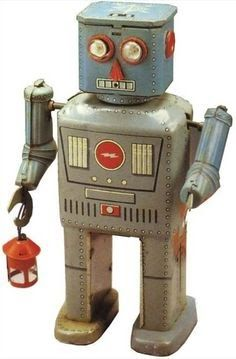
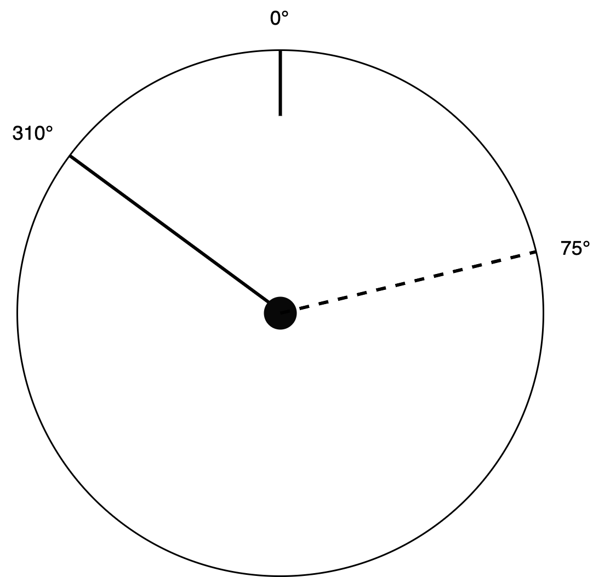

# Steering Direction Challenge

Imagine a bright future where humanity will be able to craft buildings on remote planets with robots.

<div style="display:flex;justify-content:center;align-items:center">
  
</div>

Unfortunately our trusty robot friend *​Crafty​* is not so bright, he can only drive forward or rotate left and right.
As a Craftnote Engineer your challenge is to write a microservice with Node.js and TypeScript that calculates steering directions for *​Crafty​* through a REST API.

The service should run in a Docker container.

Your microservice should provide the following endpoint:

```javascript
GET /direction?heading=310&target=75
```

...and return result as follows:

```javascript
{
  "direction": "right"
}
```

Here `​heading​` is the absolute magnetic heading relative to the north pole of the current planet (we assume the planet has a magnetic field) and `​target​` is the absolute bearing to the target.

The response of the service should be a JSON object that contains the `​direction` as a string with values of either `​left​`, `​right​`, or `​straight​`.

The following diagram visualizes these heading and target values. Both numbers are provided as degrees ranging from `0°` to `359°`.

<div style="display:flex;justify-content:center;align-items:center">
  
</div>

## REQUIREMENTS

* Your code should be clean, performant and tested.
* Make sure to validate all inputs and handle errors appropriately.
* Don’t forget to include a `Dockerfile` for the service.
